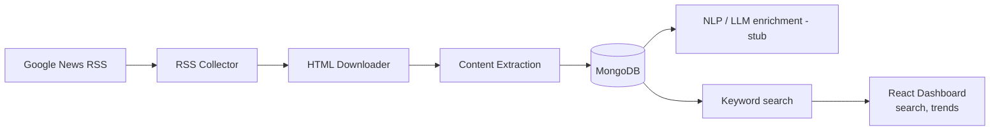

# google-news-rss-radar

A Node.js pipeline that collects Google News RSS entries, downloads and extracts full article content, stores it in MongoDB, and exposes it through a search/trends API and React dashboard.



The previous Python/Selenium implementation is archived in [legacy-python/](legacy-python/) for reference.

## Technology Stack

**Backend & pipeline**


**Frontend**


**Infra & tooling**


Other notable libraries: `rss-parser` (feed parsing), `cheerio` / `jsdom` / `@mozilla/readability` (article extraction), `commander` (CLI), `pino` (logging), `p-limit` (concurrency), `date-fns` (dates).

## Setup

```bash
docker compose up -d mongo   # or: npm run db:up
npm install
npx playwright install chromium
cp .env.example .env
cp packages/dashboard/.env.example packages/dashboard/.env
npm run db:indexes
```

## Running the pipeline

```bash
# one keyword, one date range, all four stages
npm run pipeline -- "data science" 2024-01-01 2024-01-08

# or stage by stage
npm run collect -- "data science" 2024-01-01 2024-01-08
npm run download
npm run extract
npm run enrich

# batch collect from a keyword;dateFrom;dateTo file
npm run collect-batch -- packages/backend/examples/collect-batch-input.example.txt
```

## Running the API and dashboard

```bash
npm run dev            # API on :4000 + dashboard on :5173
# or individually:
npm run api
npm run dashboard
```

## API

- `GET /api/health`
- `GET /api/articles?q=&source=&from=&to=&status=&page=&pageSize=`
- `GET /api/articles/:uuid`
- `GET /api/trends?dimension=day|source&from=&to=&source=`
- `GET /api/sources`

## Notes

- The enrichment stage (`packages/backend/src/enrich/enrich.js`) is a working pipeline stage with placeholder analysis — see the TODOs there for wiring in a real LLM call.
- Search is keyword-only (MongoDB `$text`) for now; semantic/vector search is a documented extension point in `packages/backend/src/search/searchService.js`.
